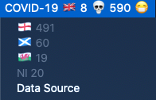

# UK COVID-19 BitBar Plugin

## Requirements

Install [Bitbar](https://getbitbar.com/)

```bash
brew install jq
```

## Installing

Clone this repository and symlink script to your Bitbar active plugins folder

```bash
git clone https://github.com/simonbowen/uk-covid-bitbar.git
cd uk-covid-bitbar
chmod +x ./uk-covid-19.10m.sh
ln -s $PWD/uk-covid-19.10m.sh <path-to-bitbar-plugins-folder>/uk-covid-19.10m.sh
```

Refresh your Bitbar plugins

## Preview

